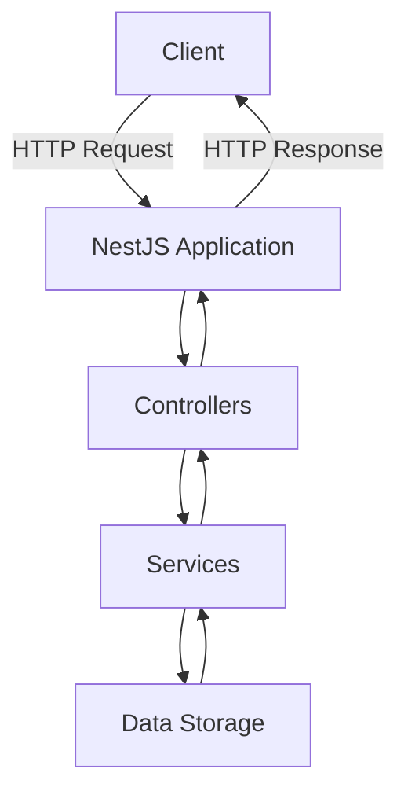
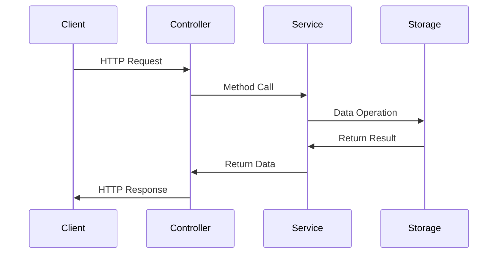

# NestJS Todo Application Tutorial

A comprehensive guide to building a Todo application using NestJS, demonstrating core concepts and best practices.

## Table of Contents
- [Application Overview](#application-overview)
- [Project Structure](#project-structure)
- [Core Concepts](#core-concepts)
- [Implementation Flow](#implementation-flow)
- [Step-by-Step Guide](#step-by-step-guide)
- [API Endpoints](#api-endpoints)
- [Best Practices](#best-practices)

## Application Overview

This Todo application is built using NestJS, a progressive Node.js framework for building efficient and scalable server-side applications. The application implements a RESTful API for managing todo items with full CRUD (Create, Read, Update, Delete) operations.



## Project Structure

```
src/
├── main.ts                 # Application entry point
├── app.module.ts           # Root application module
└── todo/                   # Todo feature module
    ├── dto/                # Data Transfer Objects
    ├── entities/           # Entity definitions
    ├── todo.controller.ts  # Request handlers
    ├── todo.module.ts      # Module configuration
    └── todo.service.ts     # Business logic
```

## Core Concepts

### 1. Modules
Modules are the building blocks of NestJS applications. The `TodoModule` encapsulates related functionality:

```typescript
@Module({
  controllers: [TodoController],
  providers: [TodoService],
})
export class TodoModule {}
```

### 2. Controllers
Controllers handle incoming HTTP requests and define API endpoints:

```typescript
@Controller('todos')
export class TodoController {
  @Get()
  findAll() { ... }

  @Post()
  create(@Body() createTodoDto: CreateTodoDto) { ... }
}
```

### 3. Services
Services contain business logic and are injected into controllers:

```typescript
@Injectable()
export class TodoService {
  create(createTodoDto: CreateTodoDto): Todo { ... }
  findAll(): Todo[] { ... }
}
```

### 4. DTOs (Data Transfer Objects)
DTOs define the shape of data for API requests:

```typescript
export class CreateTodoDto {
  title: string;
}
```

## Implementation Flow



## Step-by-Step Guide

### 1. Project Setup

```bash
npm install -g @nestjs/cli
nest new todo-app
cd todo-app
npm run start:dev
```
Visit http://localhost:3000 to verify the app is running (should show "Hello World!").

### 2. Generate Todo Module, Controller, and Service

```bash
nest generate module todo
nest generate controller todo
nest generate service todo
```
Check: Ensure `src/todo/` contains `todo.module.ts`, `todo.controller.ts`, and `todo.service.ts`.

### 3. Define the Todo Entity

Create `src/todo/entities/todo.entity.ts`:
```typescript
export class Todo {
  id: number;
  title: string;
  completed: boolean;
}
```
Check: File exists and matches above.

### 4. Create DTOs

Create `src/todo/dto/create-todo.dto.ts`:
```typescript
export class CreateTodoDto {
  title: string;
}
```

Create `src/todo/dto/update-todo.dto.ts`:
```typescript
export class UpdateTodoDto {
  title?: string;
  completed?: boolean;
}
```
Check: Both DTO files exist and match above.

### 5. Implement the Service Layer

Edit `src/todo/todo.service.ts`:
```typescript
import { Injectable, NotFoundException } from '@nestjs/common';
import { Todo } from './entities/todo.entity';
import { CreateTodoDto } from './dto/create-todo.dto';
import { UpdateTodoDto } from './dto/update-todo.dto';

@Injectable()
export class TodoService {
  private todos: Todo[] = [];
  private idCounter = 1;

  create(createTodoDto: CreateTodoDto): Todo {
    const todo: Todo = {
      id: this.idCounter++,
      title: createTodoDto.title,
      completed: false,
    };
    this.todos.push(todo);
    return todo;
  }

  findAll(): Todo[] {
    return this.todos;
  }

  findOne(id: number): Todo {
    const todo = this.todos.find(t => t.id === id);
    if (!todo) throw new NotFoundException('Todo not found');
    return todo;
  }

  update(id: number, updateDto: UpdateTodoDto): Todo {
    const todo = this.findOne(id);
    if (updateDto.title !== undefined) todo.title = updateDto.title;
    if (updateDto.completed !== undefined) todo.completed = updateDto.completed;
    return todo;
  }

  remove(id: number): void {
    const idx = this.todos.findIndex(t => t.id === id);
    if (idx === -1) throw new NotFoundException('Todo not found');
    this.todos.splice(idx, 1);
  }
}
```
Check: Service implements all CRUD methods.

### 6. Implement the Controller

Edit `src/todo/todo.controller.ts`:
```typescript
import { Controller, Get, Post, Body, Param, Put, Delete } from '@nestjs/common';
import { TodoService } from './todo.service';
import { CreateTodoDto } from './dto/create-todo.dto';
import { UpdateTodoDto } from './dto/update-todo.dto';
import { Todo } from './entities/todo.entity';

@Controller('todos')
export class TodoController {
  constructor(private readonly todoService: TodoService) {}

  @Post()
  create(@Body() createTodoDto: CreateTodoDto): Todo {
    return this.todoService.create(createTodoDto);
  }

  @Get()
  findAll(): Todo[] {
    return this.todoService.findAll();
  }

  @Get(':id')
  findOne(@Param('id') id: string): Todo {
    return this.todoService.findOne(Number(id));
  }

  @Put(':id')
  update(@Param('id') id: string, @Body() updateDto: UpdateTodoDto): Todo {
    return this.todoService.update(Number(id), updateDto);
  }

  @Delete(':id')
  remove(@Param('id') id: string): void {
    return this.todoService.remove(Number(id));
  }
}
```
Check: Controller exposes all REST endpoints.

### 7. Wire Up the Module

Ensure `src/todo/todo.module.ts` includes:
```typescript
import { Module } from '@nestjs/common';
import { TodoService } from './todo.service';
import { TodoController } from './todo.controller';

@Module({
  controllers: [TodoController],
  providers: [TodoService],
})
export class TodoModule {}
```
Check: Module is configured with controller and service.

### 8. Register the Todo Module

Edit `src/app.module.ts`:
```typescript
import { Module } from '@nestjs/common';
import { TodoModule } from './todo/todo.module';

@Module({
  imports: [TodoModule],
})
export class AppModule {}
```
Check: AppModule imports TodoModule.

### 9. Test the API Endpoints

Start the server:
```bash
npm run start:dev
```
Use a tool like Postman or curl to test:
- `GET /todos` (should return empty array)
- `POST /todos` with `{ "title": "First Task" }`
- `GET /todos` (should return array with one todo)
- `GET /todos/1` (should return the created todo)
- `PUT /todos/1` with `{ "completed": true }`
- `DELETE /todos/1`
Check: Each endpoint works as expected.

### 10. Next Steps
- Add validation using `class-validator` and `@nestjs/common` decorators
- Add persistence (e.g., connect to a database)
- Write automated tests
- Add API documentation with Swagger

---

Each step above includes a checkpoint to verify progress before moving on. This ensures a smooth learning experience for beginners.

## API Endpoints

| Method | Endpoint     | Description         |
|--------|-------------|---------------------|
| GET    | /todos      | Get all todos      |
| GET    | /todos/:id  | Get todo by ID     |
| POST   | /todos      | Create new todo    |
| PUT    | /todos/:id  | Update todo by ID  |
| DELETE | /todos/:id  | Delete todo by ID  |

## Best Practices

1. **Dependency Injection**
   - Use constructor injection
   - Follow IoC principles

2. **Error Handling**
   - Implement exception filters
   - Use built-in HTTP exceptions

3. **Code Organization**
   - Follow modular architecture
   - Separate concerns

4. **Type Safety**
   - Use TypeScript features
   - Implement interfaces and DTOs

5. **Documentation**
   - Add JSDoc comments
   - Document API endpoints

## Running the Application

```bash
# Development
npm run start:dev

# Production
npm run build
npm run start:prod
```

Access the API at `http://localhost:3000/todos`
