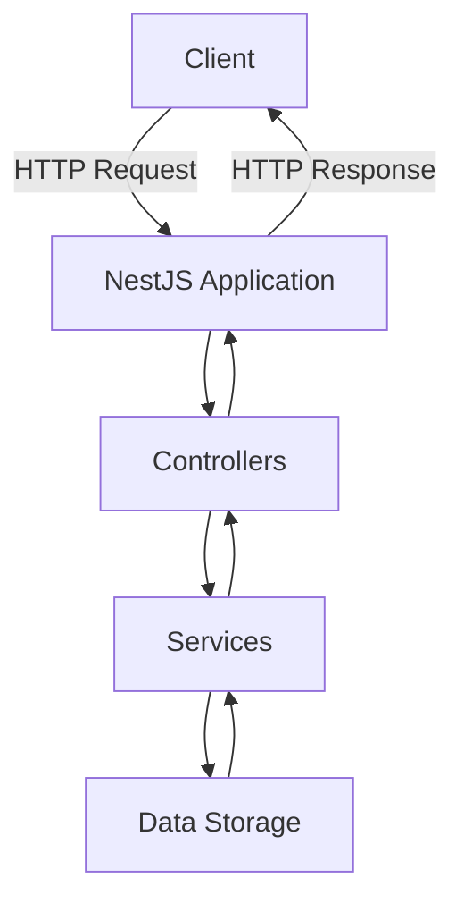
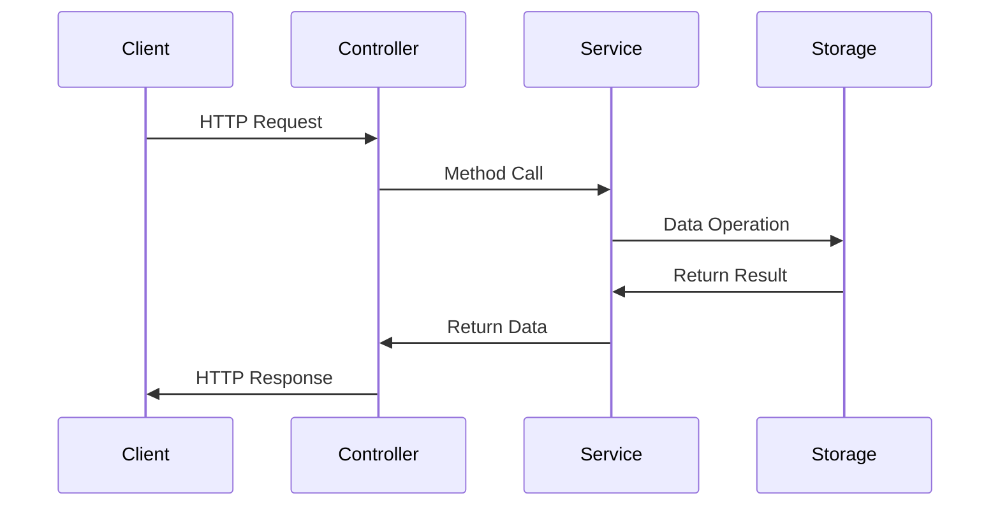

# NestJS Todo Application Tutorial

A comprehensive guide to building a Todo application using NestJS, demonstrating core concepts and best practices.

## Table of Contents
- [Application Overview](#application-overview)
- [Project Structure](#project-structure)
- [Core Concepts](#core-concepts)
- [Implementation Flow](#implementation-flow)
- [Step-by-Step Guide](#step-by-step-guide)
- [API Endpoints](#api-endpoints)
- [Best Practices](#best-practices)

## Application Overview

This Todo application is built using NestJS, a progressive Node.js framework for building efficient and scalable server-side applications. The application implements a RESTful API for managing todo items with full CRUD (Create, Read, Update, Delete) operations.



## Project Structure

```
src/
├── main.ts                 # Application entry point
├── app.module.ts           # Root application module
└── todo/                   # Todo feature module
    ├── dto/                # Data Transfer Objects
    ├── entities/           # Entity definitions
    ├── todo.controller.ts  # Request handlers
    ├── todo.module.ts      # Module configuration
    └── todo.service.ts     # Business logic
```

## Core Concepts

### 1. Modules
Modules are the building blocks of NestJS applications. The `TodoModule` encapsulates related functionality:

```typescript
@Module({
  controllers: [TodoController],
  providers: [TodoService],
})
export class TodoModule {}
```

### 2. Controllers
Controllers handle incoming HTTP requests and define API endpoints:

```typescript
@Controller('todos')
export class TodoController {
  @Get()
  findAll() { ... }

  @Post()
  create(@Body() createTodoDto: CreateTodoDto) { ... }
}
```

### 3. Services
Services contain business logic and are injected into controllers:

```typescript
@Injectable()
export class TodoService {
  create(createTodoDto: CreateTodoDto): Todo { ... }
  findAll(): Todo[] { ... }
}
```

### 4. DTOs (Data Transfer Objects)
DTOs define the shape of data for API requests:

```typescript
export class CreateTodoDto {
  title: string;
}
```

## Implementation Flow



## Step-by-Step Guide

1. **Project Setup**
   ```bash
   npm install @nestjs/cli
   nest new todo-app
   ```

2. **Generate Todo Module**
   ```bash
   nest generate module todo
   nest generate controller todo
   nest generate service todo
   ```

3. **Define Todo Entity**
   - Create entity class with properties
   - Add validation and documentation

4. **Implement DTOs**
   - Create DTOs for data validation
   - Define request/response shapes

5. **Develop Service Layer**
   - Implement CRUD operations
   - Add business logic

6. **Create Controller**
   - Define REST endpoints
   - Add request handling
   - Implement error handling

## API Endpoints

| Method | Endpoint     | Description         |
|--------|-------------|---------------------|
| GET    | /todos      | Get all todos      |
| GET    | /todos/:id  | Get todo by ID     |
| POST   | /todos      | Create new todo    |
| PUT    | /todos/:id  | Update todo by ID  |
| DELETE | /todos/:id  | Delete todo by ID  |

## Best Practices

1. **Dependency Injection**
   - Use constructor injection
   - Follow IoC principles

2. **Error Handling**
   - Implement exception filters
   - Use built-in HTTP exceptions

3. **Code Organization**
   - Follow modular architecture
   - Separate concerns

4. **Type Safety**
   - Use TypeScript features
   - Implement interfaces and DTOs

5. **Documentation**
   - Add JSDoc comments
   - Document API endpoints

## Running the Application

```bash
# Development
npm run start:dev

# Production
npm run build
npm run start:prod
```

Access the API at `http://localhost:3000/todos`
